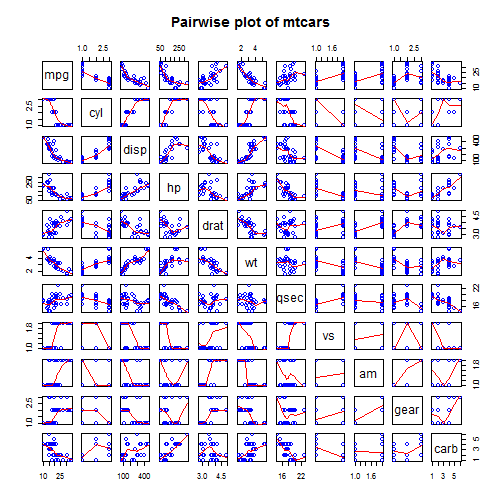
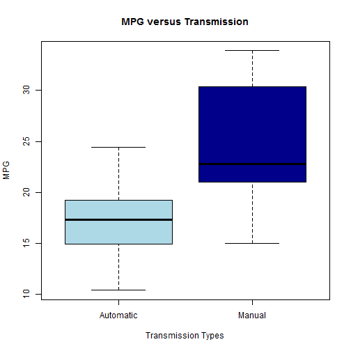
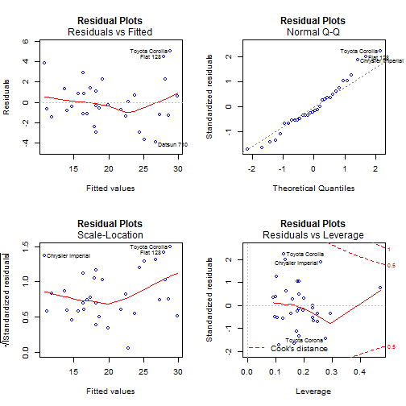

### Analysis of the Effect between Automatic and Manual Transmission on MPG
Author: Yiwei Yan
Date: January 23, 2015

#### 1. Executive Overview
A magazine about the automobile industry named  Motor Trend is interested in exploring the relationship between a set of variables and miles per gallon (MPG) (outcome). In this study, there are two main questions to be addressed and answered. One is "whether an automatic or manual transmission better for MPG", and the other is "what the MPG difference between automatic and manual transmissions". Therefore, We will utilize a dataset named "mtcars" to conduct our analysis and figure out the relationship between transmission types and MPG.

#### 2. Data Summary and Process

In our study, we utilize data from the dataset named"mtcars", which is extracted from the 1974 Motor Trend US magazine, and comprises fuel consumption and 10 aspects of automobile design and performance for 32 automobiles (1973-74 models). Specifically, "mtcars" is a dataset with 32 observations on 11 variables. Below are the variables shows in mtcars dataset: 

- mpg: Miles/(US) gallon; cyl: Number of cylinders; disp: Displacement (cu.in.);hp: Gross horsepower; drat: Rear axle ratio; wt: Weight (lb/1000); qsec: 1/4 mile time; vs: V/S; am: Transmission (0 = automatic, 1 = manual); gear: Number of forward gears; carb: Number of carburetors.

Before start our analysis, Let's open the mtcars dataset and review some detail summary about it at first:

```r
rm(list=ls())
data(mtcars)
str(mtcars)
```

```
## 'data.frame':	32 obs. of  11 variables:
##  $ mpg : num  21 21 22.8 21.4 18.7 18.1 14.3 24.4 22.8 19.2 ...
##  $ cyl : num  6 6 4 6 8 6 8 4 4 6 ...
##  $ disp: num  160 160 108 258 360 ...
##  $ hp  : num  110 110 93 110 175 105 245 62 95 123 ...
##  $ drat: num  3.9 3.9 3.85 3.08 3.15 2.76 3.21 3.69 3.92 3.92 ...
##  $ wt  : num  2.62 2.88 2.32 3.21 3.44 ...
##  $ qsec: num  16.5 17 18.6 19.4 17 ...
##  $ vs  : num  0 0 1 1 0 1 0 1 1 1 ...
##  $ am  : num  1 1 1 0 0 0 0 0 0 0 ...
##  $ gear: num  4 4 4 3 3 3 3 4 4 4 ...
##  $ carb: num  4 4 1 1 2 1 4 2 2 4 ...
```

#### 3. Model Building
In the model building process, firstly, we convert qualitative data into factors. Then, we use all variables in the dataset as predictors to run our first model (Model1).Thus, our Model1 includes all variables as predictors of mpg. 

```r
#Convert qualitative data
mtcars$cyl <- factor(mtcars$cyl)
mtcars$vs <- factor(mtcars$vs)
mtcars$carb <- factor(mtcars$carb)
mtcars$am <- factor(mtcars$am, labels = c("Automatic", "Manual"))
mtcars$gear <- factor(mtcars$gear)
Model1 = lm(mpg ~ ., data = mtcars)
s1<-summary(Model1)$coef
```

Since some variales in Model1 are not significant. So in the next step, we use the stepwise model selection to find out significant predictors and also delete the insignificant variables from Model1 to rebuild a new model named Model2 that with better fit performance. Specifically, The step function performs selection by calling lm repeatedly to build multiple models and select best variables from them using both forward and backward elimination methods by AIC. This ensures Model2 to have useful variables while omitting ones that do not contribute significantly to predicting mpg. According to he adjusted R-squared 0.84, we can conclude that more than 84% of the variability is explained by Model2 now.

```r
Model2 <- step(Model1, trace = 0, direction="both")
summary(Model2)
```

```
## 
## Call:
## lm(formula = mpg ~ cyl + hp + wt + am, data = mtcars)
## 
## Residuals:
##     Min      1Q  Median      3Q     Max 
## -3.9387 -1.2560 -0.4013  1.1253  5.0513 
## 
## Coefficients:
##             Estimate Std. Error t value Pr(>|t|)    
## (Intercept) 33.70832    2.60489  12.940 7.73e-13 ***
## cyl6        -3.03134    1.40728  -2.154  0.04068 *  
## cyl8        -2.16368    2.28425  -0.947  0.35225    
## hp          -0.03211    0.01369  -2.345  0.02693 *  
## wt          -2.49683    0.88559  -2.819  0.00908 ** 
## amManual     1.80921    1.39630   1.296  0.20646    
## ---
## Signif. codes:  0 '***' 0.001 '**' 0.01 '*' 0.05 '.' 0.1 ' ' 1
## 
## Residual standard error: 2.41 on 26 degrees of freedom
## Multiple R-squared:  0.8659,	Adjusted R-squared:  0.8401 
## F-statistic: 33.57 on 5 and 26 DF,  p-value: 1.506e-10
```

Furthermore, we compare Model2 with a basic model (ModelB) that only has one independent variable "am" as the predictor.Based on the comparison result between Model2 and ModelB, since the p-value is highly significant, we can reject the null hypothesis that variables as cyl, hp and wt do not contribute to the accuracy of the model.
As a results, according to the boxplot we draw for ModelB (Appendix Figure 2), manual transmission has 6 MPG more than that of automatic transmission in general.

```r
ModelB<-lm(mpg~am, data= mtcars)
anova(ModelB,Model2)
```

```
## Analysis of Variance Table
## 
## Model 1: mpg ~ am
## Model 2: mpg ~ cyl + hp + wt + am
##   Res.Df    RSS Df Sum of Sq      F    Pr(>F)    
## 1     30 720.90                                  
## 2     26 151.03  4    569.87 24.527 1.688e-08 ***
## ---
## Signif. codes:  0 '***' 0.001 '**' 0.01 '*' 0.05 '.' 0.1 ' ' 1
```

#### 4. Statistical Inference
In this section, we compute top three points in each case of influence measures. The data points with the most leverage in the fit using hatvalues() and most affect the model coefficients is given by the dfbetas() function. We give the residuals plots of Model2 in Appendix Figure 3.

```r
tail(sort(hatvalues(Model2)),3)
```

```
##       Toyota Corona Lincoln Continental       Maserati Bora 
##           0.2777872           0.2936819           0.4713671
```

```r
tail(sort(dfbetas(Model2)[,6]))
```

```
##        Duster 360        Camaro Z28    Toyota Corolla Chrysler Imperial 
##        0.06589986        0.08398495        0.28853987        0.35074579 
##          Fiat 128     Toyota Corona 
##        0.42920432        0.73054020
```

After that, we conduct a Two Sample t-test between the transmission types. The null hypothesis "transmission types don't have an effect on the MPG", which is discarded for a p-value greater than 0.05. The results (0.001374 p-value and difference of means) shows that the manual transmission has significantly more MPG than automatic.

```r
t.test(mpg ~ am, data = mtcars)
```

```
## 
## 	Welch Two Sample t-test
## 
## data:  mpg by am
## t = -3.7671, df = 18.332, p-value = 0.001374
## alternative hypothesis: true difference in means is not equal to 0
## 95 percent confidence interval:
##  -11.280194  -3.209684
## sample estimates:
## mean in group Automatic    mean in group Manual 
##                17.14737                24.39231
```

#### 5. Conclusion
To sum up, as shown in our analysis results, we can conclude some important results for Motor Trend: (1) The transmission types of a car do has a significant effect on the fuel efficiency (MPG). Usually, the MPG of manual transmission is more than that of automatics usually. (2) Besides, MPG will decrease by 2.5 for every 1000 lb increase in wt. (3) When cylinders (cyl) increases from 4 to 6/8, the MPG will decrease by a factor of 3/2.2 respectively.

#### 6. Appendix
##### Figure 1: Pairwise plot of mtcars

```r
pairs(mtcars, panel = panel.smooth, main = "Pairwise plot of mtcars", col="blue")
```

 
##### Figure 2: MPG versus Transmission

```r
Figure2<- boxplot(mpg ~ am, data = mtcars,
        xlab = "Transmission Types", 
        ylab = "MPG",
        main = "MPG versus Transmission", col = c("light blue","dark blue"))
```

 
##### Figure 3: Residual Plots

```r
par(mfrow=c(2,2))
plot(Model2, col = "Blue", main = "Residual Plots")
```

 
