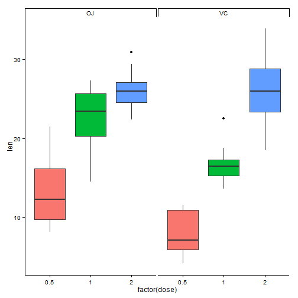
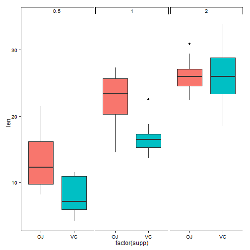
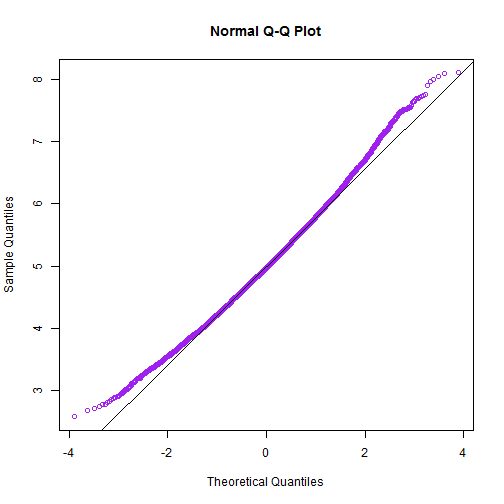
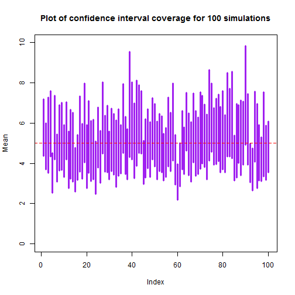

# Statistics Inference Course Puroject_Exponential Distribution Simulation (Part1)
Author: Yiwei Yan

### Overview
In this report, we investigate the exponential distribution in R and compare it with the Central Limit Theorem. The exponential distribution was simulated multiple times in R. The resulting data was analyzed to investigate the distribution of the averages of the exponential distribution. We set lambda quals to 0.2 for all of the simulations. We will conduct and report questions as below: 
1) Show the sample mean and compare it to the theoretical mean of the distribution;
2) Show how variable the sample is and compare it to the theoretical variance of the distribution;
3) Show that the distribution is approximately normal.

### Simulation
we use a rate parameter (lambda = 0.2) to produce n = 40 random variables. The mean and standard deviation of the 40 values are computed 10,000 times.


```r
library(knitr)
library(plotrix)
# Set up the experiment values
set.seed(1230)
par(xpd=NA)
lambda <- 0.2
n <- 40
```

### Results
E[x]=1/lambda is the expected value for an exponential distribution equals to 5. The mean for the experiment was calculated to be 5. According to Central Limit Theorem, the expected valueof the sample mean is equal to the mean it's trying to estimate. The distribution of the sample mean is centered at 5 and concentrated at the center (Figure 1).
In addition, the variance of the sample mean is 0.8. This corresponds with the standard error of the mean(0.793) for the 40 observations.

```r
# Generate the random variables for these n values
par(mfrow = c(2,2))
for (no_sim in c(10, 100, 1000, 10000)){
  meanValue <- NULL
  meanSD <- NULL  
  for (i in 1:no_sim){
    values <- rexp(n, lambda)
    means <- mean(values)
    sds <- sd(values)
    meanValue  <- c(meanValue, means)
    meanSD <- c(meanSD, sds)
  }
  h1 <- hist(meanValue, freq = TRUE, xlim = c(2, 8), xlab = "Values",
                 main = paste(no_sim, "simulations"),col="light yellow")
}
```

 

```r
# no_sim = 10,000 the histogram of probability density
par(mfrow = c(1,1))
h2 <- hist(meanValue, freq = FALSE, xlim = c(2, 8), xlab = "Values", ylim = c(0, .55), 
               breaks = 25, col="light yellow",
               main = paste("Figure 1: Probability Density Function for", no_sim, "Simulations"))
# Total mean and sd 
avg <- mean(meanValue)
avg
```

```
## [1] 5.006232
```

```r
s <- sd(meanValue)
s 
```

```
## [1] 0.7928717
```

```r
abline(v = avg , col = "red", lwd = 3, lty = 2)
abline(v = 5, col = "purple", lwd = 3, lty = 9)

# Theoretical normal distribution for the data set
x <- seq(min(meanValue), max(meanValue), length = 100) 
y <- dnorm(x, mean = avg, sd = s)
curve(dnorm(x, mean = avg, sd = s), 
      col = "blue", lwd = 3, lty = 3, add = TRUE)
legend('topright', c("Expected Value", "Actual Mean", "Normal Distrubution"), 
       lty=1, col=c('purple', 'red', "blue"), bty='n', cex=.75)
```

 

Below is the Q-Q plot of the mean values.  This plot result indicates aggregated sample distribution is indeed normal.

```r
qqnorm(meanValue, col = "purple")
qqline(meanValue)
```

 

In terms of the The 95% confidence interval of each simulation, which is worked out using each simulation's own sd and mean value according to Mean + 1.96*SE. The coverage was computed as the percent of times the true mean fell in each confidence interval. At last, we also plot the confidence interval for each simulation. 

```r
no_sim <- 100
meanValue<- NULL
meanSD <- NULL
for (i in 1:no_sim){
  values <- rexp(n, lambda)
  means <- mean(values)
  sds <- sd(values)
  meanValue <- c(meanValue, means)
  meanSD <- c(meanSD, sds)
}
# 95% confidence interval for each simulation
upper <- meanValue +  1.96 * (meanSD/sqrt(n))
lower <- meanValue -  1.96 * (meanSD/sqrt(n))
sum(lower < 5 & 5 < upper)/no_sim * 100
```

```
## [1] 95
```

```r
index <- c(1:no_sim)
plot(index, upper, ylim = c(0, 10), type = "n", xlab = "Index", ylab = "Mean", 
     main = "Plot of confidence interval coverage for 100 simulations",col="purple")
segments(index, upper, index, lower, col = "purple", lwd = 3)
text(-8, 5, expression(paste("", mu, "")), cex = 1.5)
ablineclip(h=5, x1 = -2.5, lty = 2, col="red")
```

 
